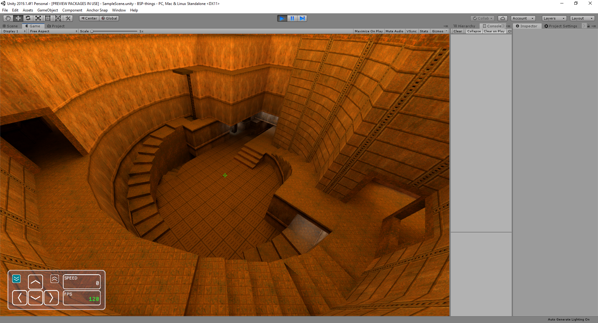

## q2unity
This project is an attempt to bring Quake II movement physics to Unity engine.

Presentation video: [click](https://www.youtube.com/watch?v=IuklKuGx-G8)

#### Important note
The project's goal has been meet and this repository is no longer actively developed. Feel free to ask
questions about this implementation if you have any.

#### Movement support
The project provides a fully functional Quake II movement in Unity (while using BSP maps).
The entire movement code is based on original id Software's sources and (apparently) works exactly the same
as the original.

#### Game file support
The game has a partial (most features are working) support of Q2 BSP map files including textures, lightmaps
and collision detection. Some entities were implemented by me (for "Jump Mod" purposes).

Additionally .pak files can also be opened (automatically) in order to load original Quake II files.
